# Docmost Infrastructure


Инфраструктурный DevOps-проект по автоматизации развертывания, мониторинга и сопровождения платформы Docmost.

Проект демонстрирует полный жизненный цикл эксплуатации приложения: CI/CD, деплой, мониторинг, логирование, алертинг и автоматизированную доставку изменений.

---

# Содержание

- [О проекте](#о-проекте)
- [Архитектура решения](#архитектура-решения)
- [Используемый стек](#используемый-стек)
- [CI/CD Pipeline](#cicd-pipeline)
- [Структура проекта](#структура-проекта)
- [Развертывание](#развертывание)
- [Результаты](#результаты)
- [Практики и подходы](#практики-и-подходы)

---

## О проекте

Проект представляет собой полноценную инфраструктурную платформу для размещения и сопровождения приложения **Docmost** — open-source решения для управления документацией и базой знаний. В рамках проекта реализован полный цикл эксплуатации приложения: автоматизированное развертывание, доставка изменений через CI/CD, мониторинг состояния сервисов, централизованный сбор логов, алертинг и контроль доступности компонентов инфраструктуры.

Проект охватывает не только запуск самого приложения, но и всю экосистему, необходимую для его стабильной эксплуатации. Реализованы механизмы непрерывной доставки изменений, централизованного мониторинга и логирования, автоматического обнаружения инцидентов и уведомления о проблемах. В результате получается воспроизводимая инфраструктура, максимально приближенная к подходам, используемым в production-среде.

[](https://github.com/docmost/docmost)

[](https://docmost.com/docs)

---

# Архитектура решения

<p align="center">
  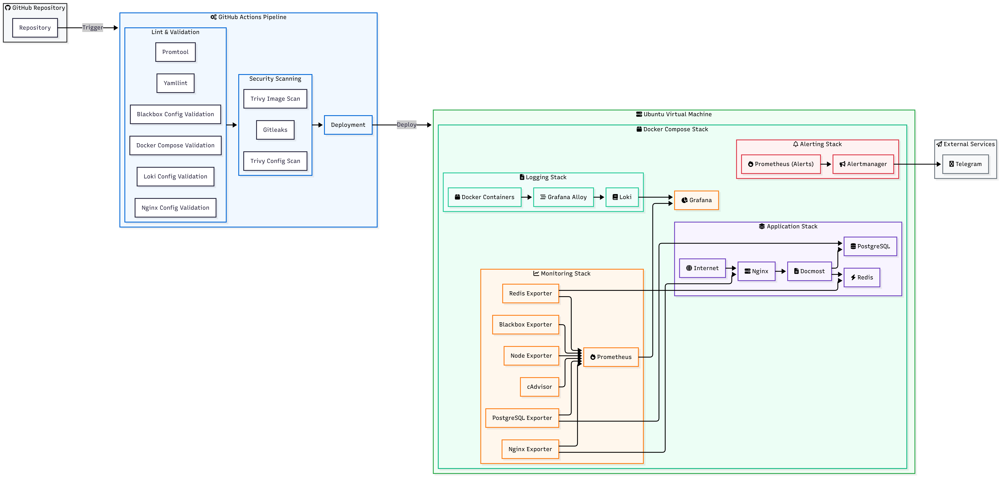
</p>

### Поток работы системы

1. Vagrant разворачивает воспроизводимое тестовое окружение с Docker и GitHub Self-Hosted Runner
2. Разработчик отправляет изменения в GitHub-репозиторий
3. GitHub Actions запускает CI/CD pipeline
4. Выполняются проверки качества конфигурации и безопасности проекта
5. Pipeline передаёт задачу на Self-Hosted Runner
6. Runner выполняет обновление Docker Compose инфраструктуры
7. Изменения автоматически применяются к приложению и сопутствующим сервисам
8. Prometheus собирает метрики хоста и контейнеров
9. Alloy доставляет логи в Loki для централизованного хранения
10. Grafana предоставляет единый интерфейс для наблюдения за состоянием системы
11. Alertmanager отправляет уведомления при обнаружении проблем и изменении состояния сервисов

---

# Используемый стек

<p align="center">
  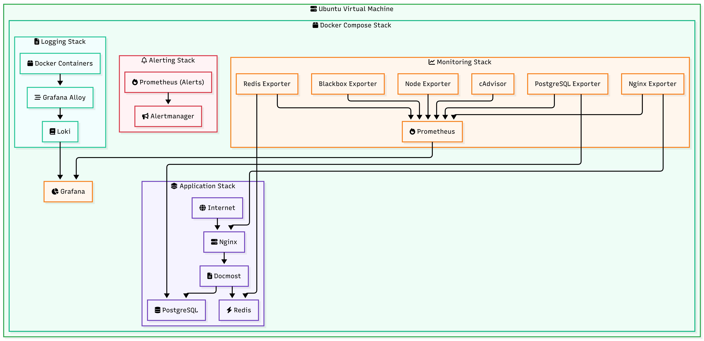
</p>

### Основные компоненты

* **Docker Compose** — оркестрация и управление запуском локального стека сервисов
* **Docmost** — основное приложение для управления документацией и базой знаний
* **PostgreSQL** — реляционная база данных для хранения данных приложения
* **Redis** — in-memory хранилище для кэширования и обработки фоновых задач
* **Nginx** — reverse proxy, точка входа и маршрутизация HTTP-запросов
* **Prometheus** — система сбора и хранения метрик, а также управления правилами алертинга
* **Grafana** — платформа для визуализации метрик, логов и состояния инфраструктуры
* **Loki** — система централизованного хранения и индексации логов
* **Alloy** — агент для сбора и доставки логов и метрик в системы мониторинга
* **Alertmanager** — маршрутизация, группировка и отправка уведомлений (включая интеграцию с Telegram)
* **Blackbox Exporter** — blackbox-мониторинг доступности HTTP-эндпоинтов и сервисов
* **cAdvisor** — мониторинг потребления ресурсов и состояния Docker-контейнеров
* **Node Exporter** — сбор метрик операционной системы и аппаратных ресурсов хост-машины
* **PostgreSQL Exporter** — экспорт метрик состояния и производительности базы данных PostgreSQL
* **Redis Exporter** — экспорт метрик состояния и потребления памяти Redis
* **Nginx Exporter** — экспорт метрик активных соединений и запросов Nginx

---

# CI/CD Pipeline

<p align="center">
  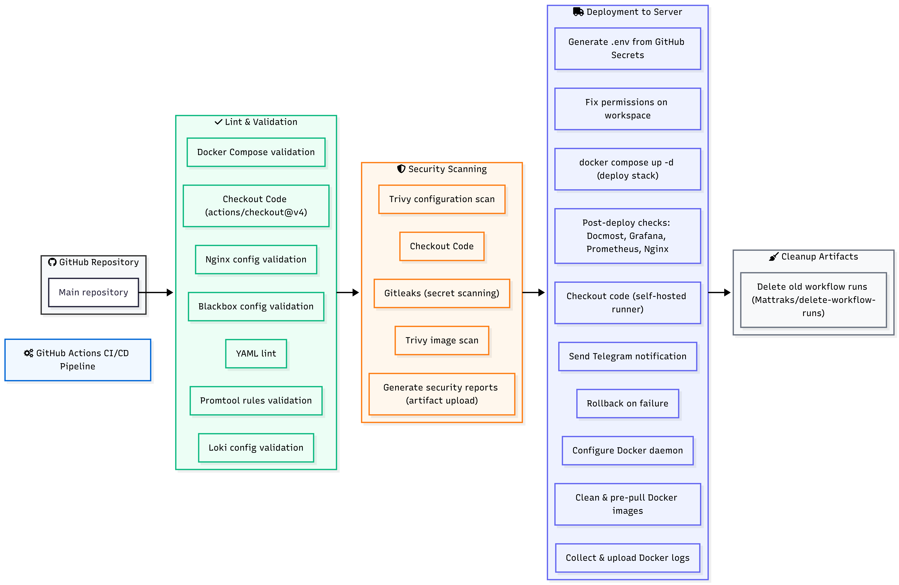
</p>

---

# Структура проекта

<details open>
<summary><strong>Показать структуру проекта</strong></summary>

```text
.
├── README.md                                   # Документация проекта
├── Vagrantfile                                 # Автоматизированное создание тестового окружения
│
├── assets                                      # Схемы архитектуры, CI/CD и Grafana dashboards
│   └── ...
│
├── .github
│   └── workflows
│       └── deploy.yml                          # GitHub Actions CI/CD Pipeline
│
└── docmost
    ├── docker-compose.yml                      # Основной стек сервисов
    │
    ├── nginx
    │   └── conf.d
    │       └── default.conf                    # Конфигурация Nginx Reverse Proxy
    │
    └── monitoring
        ├── prometheus
        │   ├── prometheus.yml                  # Конфигурация Prometheus
        │   └── rules
        │       └── alerts.yml                  # Правила алертинга
        │
        ├── alertmanager
        │   ├── alertmanager.yml                # Маршрутизация уведомлений
        │   └── templates
        │       └── telegram.tmpl               # Telegram шаблоны сообщений
        │
        ├── grafana
        │   └── provisioning
        │       ├── datasources
        │       │   └── ds.yml                  # Источники данных Grafana
        │       │
        │       └── dashboards
        │           ├── dashboards.yml          # Автоматическая загрузка дашбордов
        │           └── json
        │               └── dashboard-*.json    # JSON описание дашборда
        │
        ├── loki
        │   └── loki-config.yaml                # Конфигурация Loki
        │
        ├── alloy
        │   └── config.alloy                    # Сбор и доставка логов
        │
        └── blackbox
            └── blackbox.yml                    # Мониторинг доступности сервисов
```

</details>

---

# Развертывание

Инфраструктура проекта разворачивается в локальном тестовом окружении на базе Vagrant.

Vagrant создаёт виртуальную машину, которая одновременно выполняет роль сервера приложения и GitHub Self-Hosted Runner для выполнения CI/CD pipeline.

### Подготовка окружения

Создание и запуск виртуальной машины:

```bash
vagrant up
```

После запуска виртуальной машины становятся доступны Docker, Docker Compose и GitHub Self-Hosted Runner.

### Первоначальное развертывание

Первоначальный запуск приложения и инфраструктурных сервисов выполняется через Docker Compose.

```bash
cd docmost

docker compose up -d
```

В результате автоматически разворачивается полный стек компонентов, необходимых для работы приложения, мониторинга, централизованного логирования и алертинга.

### Автоматический деплой

Основным способом доставки изменений является CI/CD pipeline.

После отправки изменений в репозиторий GitHub Actions автоматически запускает workflow, выполняет проверки конфигурации и безопасности, после чего передаёт задачу на GitHub Self-Hosted Runner.

```bash
git add .
git commit -m "Update infrastructure"
git push origin main
```

Runner выполняет обновление Docker Compose стека и применяет изменения без необходимости ручного подключения к серверу.

### Состояние развернутой инфраструктуры

После успешного деплоя виртуальная машина содержит полный набор компонентов, необходимых для работы приложения и его сопровождения: прикладные сервисы, базы данных, reverse proxy, систему мониторинга, централизованное логирование и алертинг.

<p align="center">
  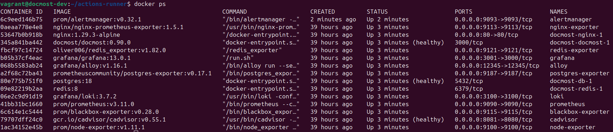
</p>

---

# Результаты

## CI/CD Deployment

<p align="center">
  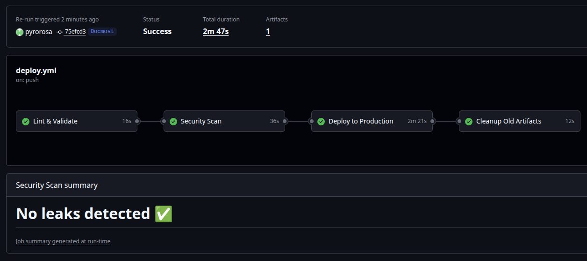
</p>

---

## Мониторинг хоста

<p align="center">
  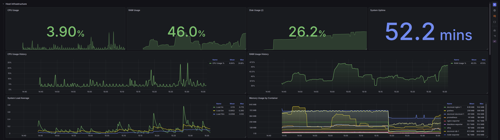
</p>

---

## Мониторинг контейнеров

<p align="center">
  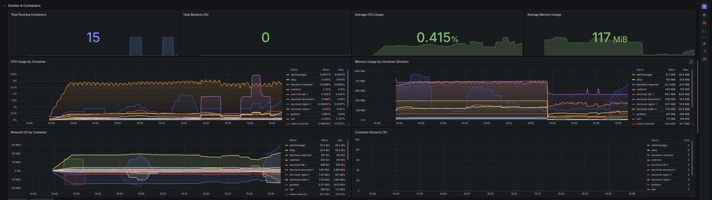
</p>

---

## Мониторинг сервисов

<p align="center">
  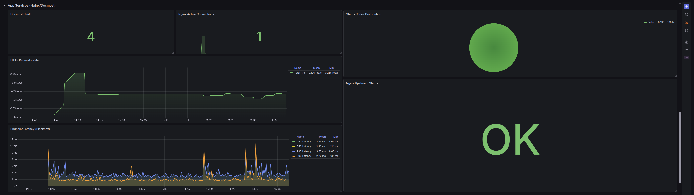
</p>

---

## Логи инфраструктуры

<p align="center">
  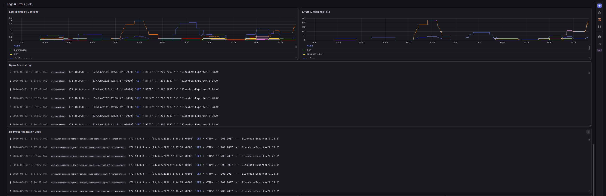
</p>

<p align="center">
  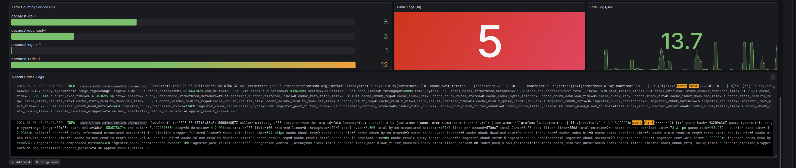
</p>

---

## CI/CD Notifications

Демонстрация уведомлений GitHub Actions о результатах выполнения CI/CD pipeline:

- успешное или неуспешное завершение деплоя
- информация о репозитории и ветке запуска
- сведения о коммите и авторе изменений
- ссылка на workflow для диагностики ошибок при сбое

<p align="center">
  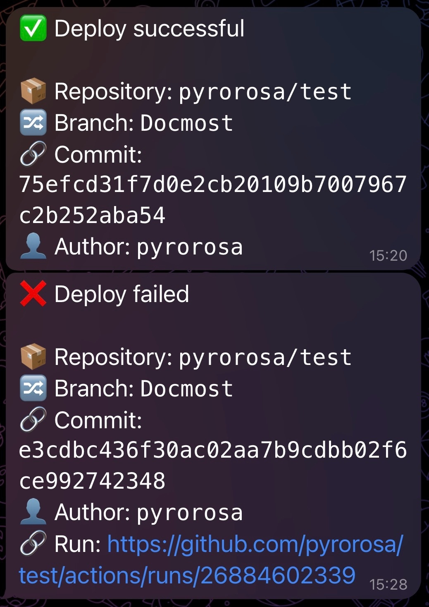
</p>

---

## Alertmanager Alerts

Демонстрация уведомлений системы мониторинга при возникновении инфраструктурных инцидентов:

- недоступность контейнеров и сервисов
- отказ PostgreSQL и Redis
- недоступность HTTP-эндпоинтов приложения
- высокая загрузка процессора
- повышенное потребление оперативной памяти
- нехватка свободного места на диске
- уведомления о возникновении и устранении инцидентов

<p align="center">
  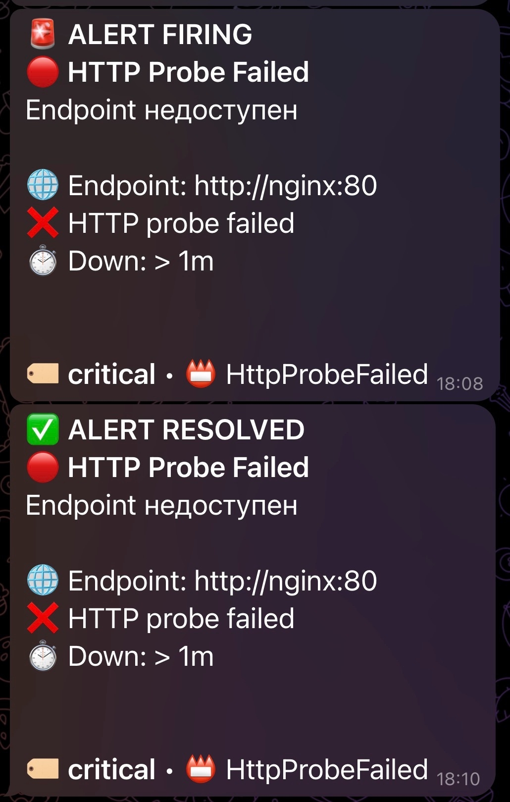
</p>

---

# Практики и подходы

- Infrastructure as Code (IaC)
- CI/CD (GitHub Actions)
- Containerization (Docker)
- Observability (Metrics + Logs + Alerts)
- Centralized Logging
- Reverse Proxy Architecture
- Self-Healing Infrastructure